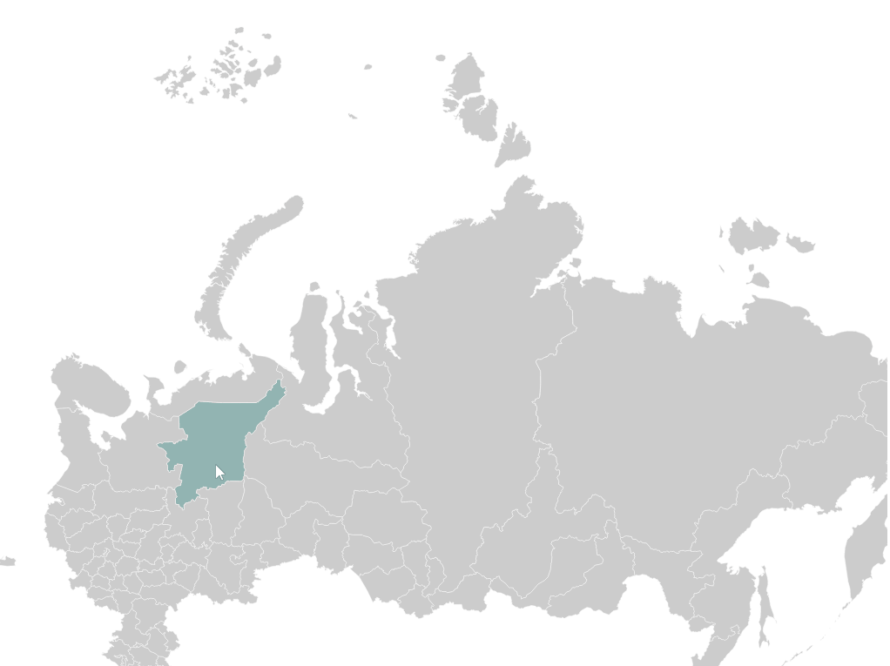
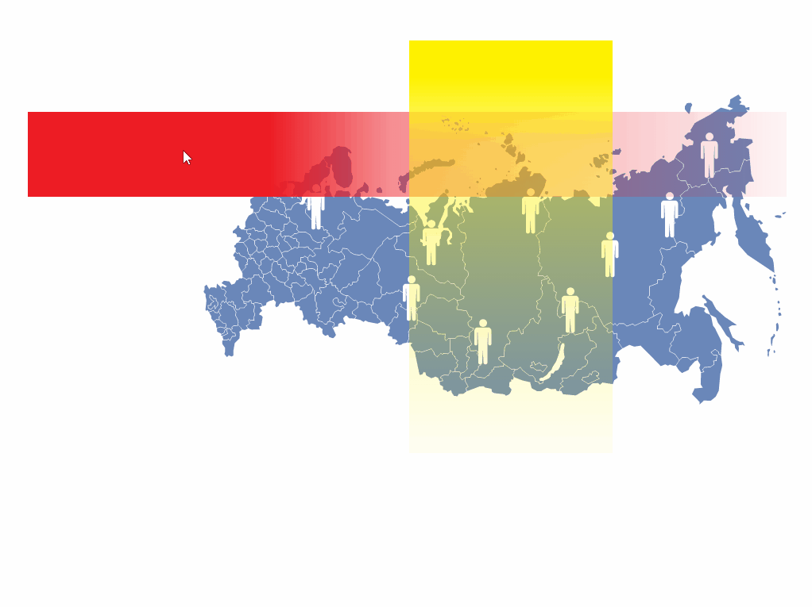
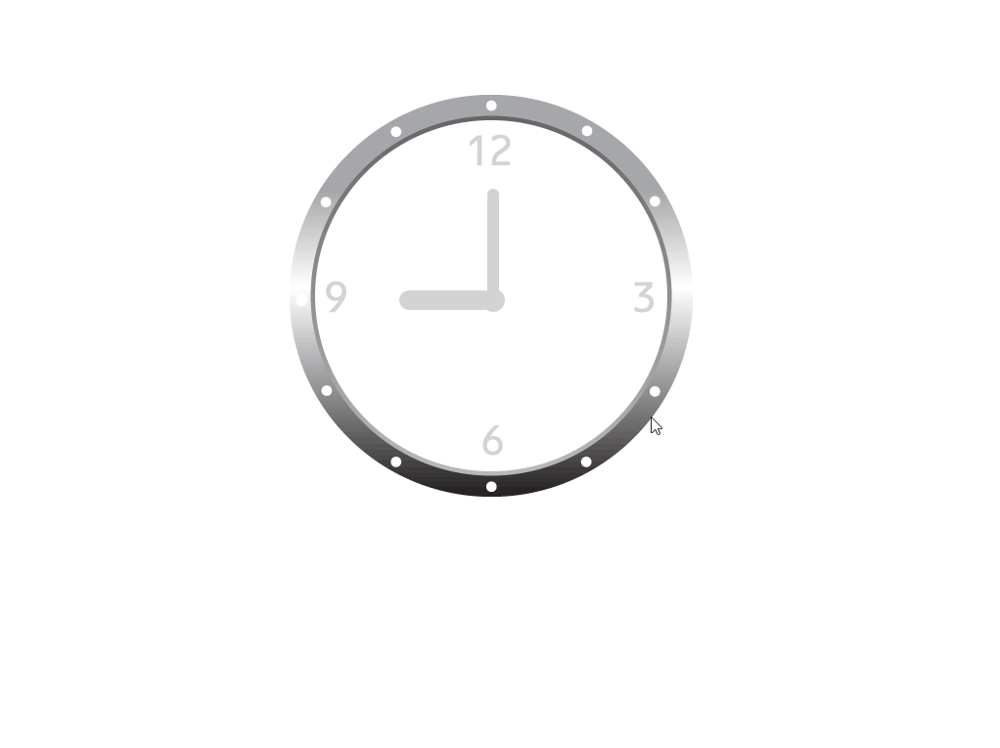

<h1>Frontend developer interview test</h1>

```
Срок - 1 день.
```

<h2>Задания</h2>

<h3>1. Нарезка</h3>

"Порезать" PSD файл-макет в html страницу. На выходе должен быть html документ идентичный PSD макету. В этом документе каждый слой PSD файла должен соответствовать html элементу на странице.

<h3>2. Основы</h3>


Дана html страница, на которой необходимо разместить несколько элементов и выполнить ряд подзадач: 
* Используя только html и css создать четыре элемента на странице в произвольном порядке и произвольном расположении. Необходимо проанимировать эти четыре элемента используя css свойства transition или animation. 
* Первому элементу необходимо менять прозрачность, второму угол наклона, третьему размер, четвертому позицию. Значения на которые происходят изменения, направления и длительность по желанию. Запускать анимации по нажатию на кнопку. 
* Выполнить те же самые анимации для элементов что и в первом пункте только по средствам jQuery а не CSS. 
    

<h3>3. jQuery UI. Drag&Drop</h3>


Дана страница-макет, которая уже сверстана. На этой странице располагаются мешок с подарками, четыре подарка, два фона, и две плашки. Задача переместить в мешок все четыре подарка. После того как будет перемещен четвертый подарок в мешок один фон должен исчезнуть а другой появится и через некоторое время должны появится две плашки. Одна плашка должна изменить прозрачность а вторая выехать из за экрана.
Поведение подарков: 
* Подарок можно перетаскивать. 
* Подарок нужно перетащить в мешок и отпустить, при этом должна произойти анимации падения подарка в мешок и исчезания. 
* Если подарок при перетаскивании отпустили не над мешком то он должен вернутся на свое место.
    
<h3>4. jQuery UI. Slider</h3>


Можно использовать любые jQuery UI модули. Необходимо сделать слайдер при изменении значения которого появлялись зеленые плашки в порядке возрастания/убывания (шкала громкости) в зависимости от положения ползунка. Под слайдером необходимо вывести текст показывающий текущее значение слайдера в цифрах. Размеры шкалы и диапазон значений ползунка может быть любым. 

<h3>5. Canvas</h3>


Дана страница с элементом canvas. Необходимо нарисовать на этом элемента прямоугольник, списать в него текст по центру и с помощью путей провести линию из точки A в точку B. Все размеры и координаты на усмотрение.

<h3>6. SVG</h3>



Дана карта России. Необходимо сделать так что бы при наведении на регион он становился синим а при клике на него - красным. 

<h3>7. jQuery UI</h3>



Дана карта на которой расположены значки людей белого цвета. Карту под прямым углом пересекают два прямоугольника. Один прямоугольник (горизонтальный) красного цвета градиентом уходящий в прозрачность с лева на право. Второй желтый, так же градиентом уходящий в прозрачность сверху вниз. Желтый прямоугольник неподвижный и располагается в середине карты пересекая ее полностью. Красный может двигается в пределах карты и так же пересекает ее полностью. Не один не второй прямоугольник не покрывает карту полностью. Необходимо сделать так что бы фигурки людей в том месте на карте которое покрывает и желтый и красный прямоугольник одновременно (ну район площади пересечения двух прямоугольников) становились красными и обратно становились белыми вне зоны пересечения. 

<h3>8. jQuery и CSS</h3>



Дан циферблат часов со стрелками. Необходимо заставить с помощью jQuery или CSS стрелки вращаться в часах. Помимо этого во время вращения стрелок на часах вокруг циферблата должна обрисовываться линия огибающая корпус циферблата как это показано в примере.
